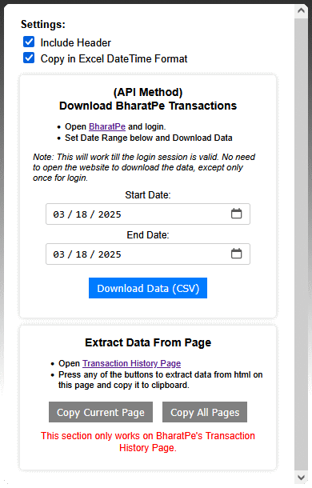

# BharatPe Txn-Excel: Transaction Data Extractor

## Overview

This Firefox extension allows BharatPe business users to extract transaction data effortlessly. You can now **download transactions directly via BharatPe’s API** or **copy data from the Transaction History page** for Excel.

## Features

✅ **API-based transaction downloads (from any page)**  
✅ **Auto-authentication for seamless fetching (BharatPe tab required only during first-time login)**  
✅ **Settings for data formatting options (Include Header, Excel Date-Time Format)**  
✅ **Webpage data extraction now works only on the Transaction History page**  

### Existing Features
- Extracts the following fields: **Received From, UTR ID, VPA, Date & Time, Amount**.
- **Formats data** in an Excel-friendly format (tab-separated values).
- **Converts Date & Time** to Excel decimal format for easy calculations.
- Supports **both manual and API-based extraction**.
- Provides **keyboard shortcuts** for quick access.

---

## Usage

### 1️⃣ API-Based Download (Recommended)
✔ Works from **any page**, no need to be on the BharatPe website.  
✔ Only requires **login once per session**; no need to keep BharatPe open.  

1. **Go to the extension popup** and select **"Download via API"**.
2. **Choose a date range** and click **"Download Transactions"**.
3. The data will be fetched from **BharatPe’s API** and saved as an Excel-ready CSV file.  
4. If not logged in or if the auth token is missing, the extension will **automatically find an open BharatPe tab** and extract credentials.  

> **Note:** If no BharatPe tab is open, login manually and try again. Once authenticated, future downloads work without opening BharatPe until session expiry.

---

### 2️⃣ Webpage Extraction (Legacy Method)
✔ Works **only on the BharatPe Transaction History page**.  
✔ Data is copied to the clipboard for pasting into Excel.  

1. **Go to the BharatPe Transaction History page**:  
   ➝ [BharatPe Transaction History](https://enterprise.bharatpe.in/transactionhistory)
2. **Use one of the following options to copy data:**
   - **Copy Current Page** → Click the button in the extension popup or press `Ctrl + Alt + C`.
   - **Copy All Pages** → Click the button in the extension popup or press `Ctrl + Alt + A`.
3. **Paste the copied data into Excel** (formatted for analysis).

> **⚠ This feature only works on the Transaction History page.**  

---

## Settings
Located in the **extension popup**, allowing users to customize extraction behavior:

- **Include Header** → Adds column headers when extracting data.  
- **Copy in Excel DateTime Format** → Converts date-time values into Excel-compatible decimal format.  

---

## Keyboard Shortcuts
- `Ctrl + Alt + C` → Copy transaction data from the **current page**.
- `Ctrl + Alt + A` → Copy transaction data from **all pages**.

---

## Notes
- API-based downloading **works from any page** (as long as the session is active).
- **Auto-authentication** ensures seamless transaction fetching.
- If no **BharatPe tab is open** during the first-time authentication, the user needs to login manually.
- The **webpage extraction method only works on the Transaction History page**.
- **A maximum of 10,000 records are fetched when using the API Based download mode**.